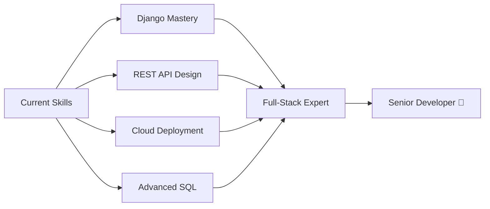

# 👋 Welcome to My Digital Space!

<div align="center">
  
  

  
  
</div>

---

## 🎯 Who Am I?

```javascript
const sadik = {
    location: "Kushtia, Bangladesh 🇧🇩",
    education: "BE in Computer Science & Engineering",
    university: "Chandigarh University 🎓",
    role: "Junior Software Engineer",
    passions: ["Web Development", "Machine Learning", "Data Analytics"],
    currentFocus: ["Django", "REST APIs", "Cloud Deployment", "Advanced SQL"],
    philosophy: "Code with purpose, learn with passion, build with impact 💡",
    funFact: "I debug with coffee ☕ and solve problems with logic 🧠"
};
```

---

## 🚀 What I Do Best

<table>
<tr>
<td width="50%">

### 💻 Full-Stack Development
- Building scalable web applications
- RESTful API design & integration
- Database architecture & optimization
- Responsive & modern UI/UX

</td>
<td width="50%">

### 📊 Data Science & Analytics
- Data cleaning & preprocessing
- Exploratory Data Analysis (EDA)
- Interactive dashboards & visualization
- Machine Learning model development

</td>
</tr>
</table>

---

## 🛠️ Technology Arsenal

### 🌐 Web Development
<p>
  
  
  
  
  
  
</p>

### 📊 Data & Analytics
<p>
  
  
  
  
  
  
</p>

### 🔧 Tools & Platforms
<p>
  
  
  
  
  
</p>

---

## 🏆 Featured Projects

<div align="center">

| 🎯 Project | 💡 Description | 🔧 Tech Stack | 📈 Status |
|:-----------|:---------------|:--------------|:----------|
| **🌦️ Weather App** | Real-time weather data with interactive UI | Java Servlet, JSP, REST API | ✅ Completed |
| **📊 Sales Dashboard** | Interactive analytics & business insights | SQL, Power BI, Excel | ✅ Completed |
| **🧹 Data Pipeline** | Automated ETL & cleaning workflow | Python, Pandas, SQL | ✅ Completed |
| **🤖 ML Classifier** | Predictive modeling for classification | Python, Scikit-learn | 📅 Planned |

</div>

> 💡 **More exciting projects coming soon!** Watch this space 👀

---

## 📊 GitHub Analytics

<div align="center">
  
  
  
  
  
  

</div>

---

## 🎓 Continuous Learning Journey



---

## 💼 Professional Highlights

<details>
<summary>🎯 <b>Core Competencies</b></summary>
<br>

- ✅ Full-stack web application development
- ✅ RESTful API design & implementation
- ✅ Database design & query optimization
- ✅ Data analysis & visualization
- ✅ Agile methodology & team collaboration
- ✅ Problem-solving & algorithmic thinking
- ✅ Version control & CI/CD workflows

</details>

<details>
<summary>🌱 <b>Currently Exploring</b></summary>
<br>

- 🔄 Advanced Django patterns & best practices
- 🔄 Microservices architecture
- 🔄 Docker & Kubernetes
- 🔄 AWS/Azure cloud services
- 🔄 Machine Learning deployment (MLOps)
- 🔄 GraphQL & modern API standards

</details>

<details>
<summary>🎯 <b>2025 Goals</b></summary>
<br>

- 🎯 Contribute to 5+ open-source projects
- 🎯 Build 3 production-ready applications
- 🎯 Master cloud deployment (AWS/Azure)
- 🎯 Achieve Django & Python certifications
- 🎯 Land a full-time software engineering role
- 🎯 Start technical blogging & teaching

</details>

---

## 🤝 Let's Connect & Collaborate!

<div align="center">

[](https://www.linkedin.com/in/sadik-mahmud-49751b256/)
[](mailto:mahmudsadik2003@gmail.com)
[](https://github.com/SadikMahmud2003)

### 💌 Open For:
**Internships** • **Collaborations** • **Freelance Projects** • **Tech Discussions** • **Mentorship**

</div>

---

<div align="center">
  
### ⚡ "Code is poetry written in logic" ⚡

  

</div>

---

<div align="center">
  
  **💙 Thanks for visiting! Let's build something amazing together 🚀**
  
  
  
</div>
